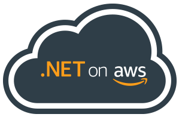

<strong>aws/dotnet</strong> is the GitHub home for .NET development on AWS.  You'll find libraries, tools, and resources to help you build .NET applications and services on AWS.

Click on the links below to jump to a section:
* [Online Resources](#Online-Resources)
* [Software and Libraries](#Software-and-Libraries)
* [.NET Development Tools](#NET-Development-Tools)
* [AWS Cloud Resources for .NET](#AWS-Cloud-Resources-for-NET)
* [Documentation](#Documentation)

## Online Resources

[AWS Developer Center - Explore .NET on AWS](https://aws.amazon.com/developer/language/net/)  
Find all the .NET code samples, step-by-step guides, videos, blog content, tools, and information about live events that you need in one place. 

[AWS Developer Blog - .NET](https://aws.amazon.com/blogs/developer/category/programing-language/dot-net/)  
Come see what .NET developers at AWS are up to!  Learn about new .NET software announcements, guides, and how-to's.

[@dotnetonaws](https://twitter.com/dotnetonaws)  
Follow us on Twitter!

## Software and Libraries

[AWS SDK for .NET](https://github.com/aws/aws-sdk-net)  
The AWS SDK for .NET enables .NET developers to easily work with Amazon Web Services and build scalable solutions with Amazon S3, Amazon DynamoDB, Amazon Glacier, and more.

[AWS Lambda for .NET Core](https://github.com/aws/aws-lambda-dotnet)  
This repository contains tools and blueprints used to create C# and Powershell AWS Lambda functions.

[AWS Extensions .NET Core Setup](https://github.com/aws/aws-sdk-net/tree/master/extensions/src/AWSSDK.Extensions.NETCore.Setup)  
  
This library is an extension for the AWS SDK for .NET to integrate with .NET Core configuration and dependency injection frameworks.

[AWS Logging .NET](https://github.com/aws/aws-logging-dotnet)  
  
These libraries integrate Amazon CloudWatch Logs with popular .NET logging libraries.

[Amazon Cognito Authentication Extension Library](https://github.com/aws/aws-sdk-net-extensions-cognito)  
  
The Amazon Cognito Extension Library simplifies the authentication process of Amazon Cognito User Pools for .NET developers.  It allows you to use various authentication methods for Amazon Cognito User Pools with only a few short method calls, along with making the process intuitive.

[AWS Secrets Manager Caching Library for .NET](https://github.com/aws/aws-secretsmanager-caching-net)  
  
The AWS Secrets Manager caching client enables in-process caching of secrets for .NET applications.

[ASP.NET Core Identity Provider for Amazon Cognito](https://github.com/aws/aws-aspnet-cognito-identity-provider)  
  
ASP.NET Core Identity Provider for Amazon Cognito simplifies using Amazon Cognito as a membership storage solution for building ASP.NET Core web applications using ASP.NET Core Identity.

[AWS .NET Configuration Extension for Systems Manager](https://github.com/aws/aws-dotnet-extensions-configuration)  
  
Configuration Extension for Systems Manager library simplifies using AWS SSM's Parameter Store as a source for configuration information for .NET Core applications. This project was contributed by [@KenHundley](https://github.com/kenhundley).

[Amazon ElastiCache Cluster Configuration for .NET](https://github.com/awslabs/elasticache-cluster-config-net)  
  
Amazon ElastiCache Cluster Configuration is an enhanced .NET library that supports connecting to an Amazon ElastiCache cluster for Auto Discovery. This client library is an extension built upon Enyim and is released under the Apache 2.0 License.

[AWS Systems Manager ASP.NET Core Data Protection Provider](https://github.com/aws/aws-ssm-data-protection-provider-for-aspnet)  
  
AWS Systems Manager ASP.NET Core Data Protection Provider library allows you to use AWS SSM's Parameter Store to store keys generated by ASP.NET's Data Protection API. This enables you to scale by allowing multiple web servers to share the keys.

[Amazon.Lambda.RuntimeSupport](https://github.com/aws/aws-lambda-dotnet/tree/master/Libraries/src/Amazon.Lambda.RuntimeSupport)  
  
 Amazon.Lambda.RuntimeSupport library makes it easy to create Lambda functions using .NET standard 2.0-compatible runtimes.

[DynamoDB Accelerator (DAX) for Microsoft .NET](https://docs.aws.amazon.com/amazondynamodb/latest/developerguide/DAX.client.run-application-dotnet.html)  
  
DynamoDB Accelerator (DAX) for Microsoft .NET -- DAX is a fully managed, in-memory cache for DynamoDB.

[AWS X-Ray SDK for .NET](https://github.com/aws/aws-xray-sdk-dotnet)  
AWS X-Ray helps developers analyze and debug distributed applications. With X-Ray, you can understand how your application and its underlying services are performing to identify and troubleshoot the root cause of performance issues and errors.

[Amazon S3 Encryption Client for .NET](https://github.com/aws/amazon-s3-encryption-client-dotnet)  
  
Amazon S3 Encryption Client for .NET is a client-side encryption library designed to make it easy for everyone to encrypt and decrypt data using industry standards and best practices. It enables you to focus on the core functionality of your application, rather than on how to best encrypt and decrypt your data.

## .NET Development Tools
[AWS Toolkit for Visual Studio 2022](https://marketplace.visualstudio.com/items?itemName=AmazonWebServices.AWSToolkitforVisualStudio2022)  
    
The AWS Toolkit for Visual Studio 2022 is an extension for Microsoft Visual Studio 2022 on Microsoft Windows. The toolkit makes it easier for developers to develop, debug, and deploy .NET and .NET Core applications using Amazon Web Services.

[AWS Toolkit for Visual Studio 2017 and 2019](https://marketplace.visualstudio.com/items?itemName=AmazonWebServices.AWSToolkitforVisualStudio2017)  
    
The AWS Toolkit for Visual Studio 2017 and 2019 is an extension for Microsoft Visual Studio 2017 and 2019 on Microsoft Windows. The toolkit makes it easier for developers to develop, debug, and deploy .NET and .NET Core applications using Amazon Web Services.

[AWS Toolkit for JetBrains](https://github.com/aws/aws-toolkit-jetbrains)  
  
The AWS Toolkit for JetBrains works with Rider and adds support for working with AWS services such as AWS Lambda and S3.

[AWS Toolkit for Visual Studio Code](https://github.com/aws/aws-toolkit-vscode)  
  
The AWS Toolkit for Visual Studio Code is a VS Code extension that lets you work with AWS services such as AWS Lambda.

[AWS Toolkit for Azure DevOps](https://github.com/aws/aws-vsts-tools)  
    
Tasks for Amazon S3, AWS Elastic Beanstalk, AWS CodeDeploy, AWS Lambda and AWS CloudFormation and more, and running commands in the AWS Tools for Windows PowerShell module and the AWS CLI.

[AWS Tools for Windows PowerShell and PowerShell Core](https://github.com/aws/aws-tools-for-powershell)  
  
  
The AWS Tools for Windows PowerShell and PowerShell Core let developers and administrators manage their AWS services from the PowerShell scripting environment.

[AWS .NET Mock Lambda Test Tool - Preview](https://github.com/aws/aws-lambda-dotnet/tree/master/Tools/LambdaTestTool)  
  
The AWS .NET Mock Lambda Test Tool is a tool that can be used to load a .NET Core Lambda project and execute the selected code inside an emulated Lambda environment. An IDE that is attached to the process hosting this tool can then debug and step through the .NET Core Lambda code. The tool is optimized for quick local debugging with minimal dependencies.

[AWS Lambda Tools for Powershell](https://www.powershellgallery.com/packages/AWSLambdaPSCore)  
The AWS Lambda Tools for Powershell can be used to create and deploy AWS Lambda functions written in PowerShell.

[AWS Extensions for dotnet CLI](https://github.com/aws/aws-extensions-for-dotnet-cli)  
  
This repository contains AWS tool extensions to the .NET CLI. These tool extensions are focused on building .NET Core and ASP.NET Core applications and deploying them to AWS services. Many of these deployment commands are the same commands the AWS Toolkit for Visual Studio uses to perform its deployment features. 

[AWS .NET deployment tool](https://github.com/aws/aws-dotnet-deploy)  
  
This repository contains the AWS .NET deployment tool for .NET CLI - the opinionated tooling that simplifies deployment of .NET applications with minimum AWS knowledge. The tool suggests the right AWS compute service to deploy your application to. It then builds and packages your application as required by the chosen compute service, generates the deployment infrastructure, deploys your application by using the Cloud Development Kit (CDK), and displays the endpoint. 

## AWS Cloud Resources for .NET

[.NET Core EC2 AMIs](https://aws.amazon.com/about-aws/whats-new/2018/03/announcing--net-core-ami-for-amazon-ec2/)  
Amazon Web Services offers Amazon Machine Images (AMI) with .NET Core on Amazon Linux 2 and Ubuntu.

[.NET Core CodeBuild Images](https://github.com/aws/aws-codebuild-docker-images/tree/master/ubuntu/dot-net)  
This repository holds Dockerfiles of official AWS CodeBuild curated Docker images. Please refer to the [AWS CodeBuild User Guide](https://docs.aws.amazon.com/codebuild/latest/userguide/build-env-ref.html) for list of environments supported by AWS CodeBuild.

## Documentation
[AWS .NET Developer Guide](https://docs.aws.amazon.com/sdk-for-net/latest/developer-guide/)  
The AWS SDK for .NET Developer Guide describes how to implement applications for AWS using the AWS SDK for .NET

[AWS SDK for .NET V3 API Reference](https://docs.aws.amazon.com/sdkfornet/v3/apidocs/Index.html)  
Official AWS SDK for .NET API reference.

[AWS Tools for Powershell Cmdlet Reference](https://docs.aws.amazon.com/powershell/latest/reference/Index.html)  
Official AWS Tools for Powershell Cmdlet reference.

[AWS Elastic Beanstalk - Working with .NET](https://docs.aws.amazon.com/elasticbeanstalk/latest/dg/create_deploy_NET.html)  
Learn about creating and deploying Elastic Beanstalk Applications in .NET Using AWS Toolkit for Visual Studio

[AWS Lambda - Lambda Functions (C#)](https://docs.aws.amazon.com/lambda/latest/dg/dotnet-programming-model.html)  
Lambda Developer guide describes in detail on how to write C# Lambda functions and how to deploy them.

[AWS Lambda - Lambda Functions (PowerShell)](https://docs.aws.amazon.com/lambda/latest/dg/powershell-programming-model.html)  
Lambda Developer guide describes in detail on how to write PowerShell Lambda functions and how to deploy them.
