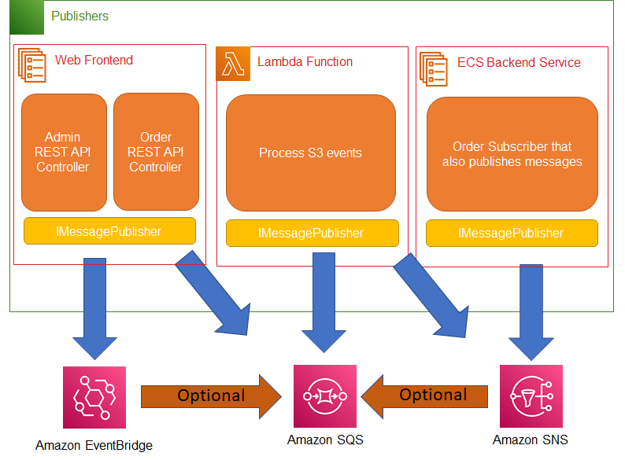
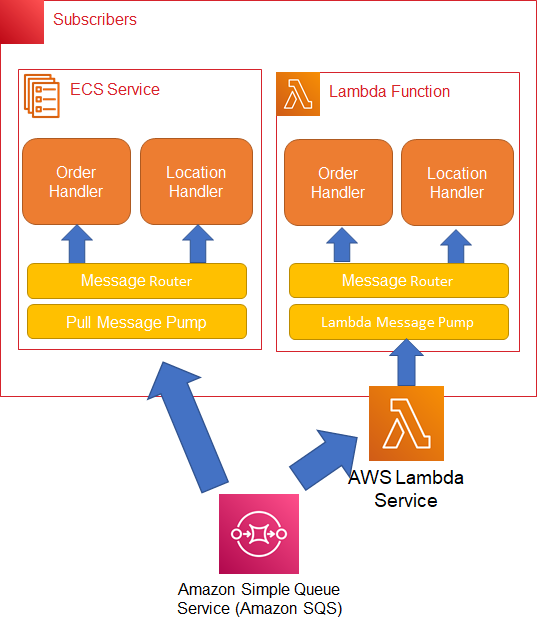

# AWS Message Processing Framework for .NET

The AWS SDK for .NET team provides tools and libraries that simplify application development for .NET developers and help them apply the best development practices from the start.

Our research shows that **message processing applications** are one of the most common application type. One typical scenario is using SQS in combination with SNS to create a publish-subscribe framework, where REST APIs publish messages to the topics and queues, and backend services act as subscribers pulling and processing messages. The current experience requires developers to use .NET SDK low level service APIs, which can become quite cumbersome. To solve this problem, several customers have created their own frameworks, but they are not supported by AWS, which is a concern for many of our customers. 

To address this issue, we are proposing an **AWS native framework that simplifies development of .NET message processing applications using AWS services.**

The purpose of the framework is to reduce the amount of boiler-plate code developers need to write. The primary responsibilities of the proposed framework are: 

- **Handling the message routing** - In a publisher, the framework will handle routing the messages to the correct queue/topic/eventbus. In a consumer process, it will route the particular message type to the appropriate business logic.
- **Handling the overall message lifecycle**  - The framework will handle serializing/deserializing the message to .NET objects, keeping track of the message visibility while it is being processed, and deleting the message when completed.

Here is an example showing a sample publisher and handler for a hypothetical `OrderInfo` message.

Sample publisher:
```csharp
[ApiController]
[Route("[controller]")]
public class OrderController : ControllerBase
{
    // See later in the design for how this was configured and mapped to the queue
    private readonly IMessagePublisher _publisher;

    public OrderController(IMessagePublisher publisher)
    {
        _publisher = publisher;
    }

    [HttpPost]
    public async Task Post([FromBody] OrderInfo orderInfo)
    {
        // Add internal metadata to the OrderInfo object 
        // we received, or any other business logic
        orderInfo.OrderTime = DateTime.UtcNow;
        orderInfo.OrderStatus = OrderStatus.Recieved;

        // The updated OrderInfo object will also be serialized as the SQS message
        await _publisher.PublishAsync(orderInfo);
    }
}
```

Sample handler:
```csharp
// See later in the design for how this was configured and mapped to the queue
public class OrderInfoHandler : IMessageHandler<OrderInfo>
{
    public async Task<MessageStatus> HandleAsync(MessageEnvelope<OrderReceived> message, CancellationToken cancellationToken = default(CancellationToken))
    {
        // Here we're reading from the message within the metadata envelope
        var productId = message.Message.ProductId;
        
        // Here we can do our business logic based on what is in the message
        await UpdateInventory(productId);
        await PrintShippingLabel(productId, message.Message.CustomerId);

        // Indicate that OrderInfo message has been processed successfully
        return MessageStatus.Success;
    }
}
```

This document breaks down into:

1. Overview of the framework components. 
2. FAQs
3. Questions for the community


## Framework Components

When systems use messaging for distributing work, there are often multiple actors in the system with each performing a different part of the message processing. For example, a commerce application could use an ASP.NET Core application to publish messages when orders are taken. Backend processes, like an ECS service or Lambda function, could be responsible for consuming the messages and performing the actual work.

### Configuration
Modern .NET heavily uses dependency injection (DI). AWS SDK for .NET integrates with the .NET DI framework using the **[.NET Dependency Injection Extensions for AWS SDK for .NET](https://docs.aws.amazon.com/sdk-for-net/v3/developer-guide/net-dg-config-netcore.html#net-core-dependency-injection)**. Many of AWS’s other high level libraries integrate with DI as well.

The message processing framework will be configured through the DI framework as well. The main configuration points are:

- Mapping .NET objects to which topics, queues or event bus to publish to (Publish points)
- Mapping .NET objects to handlers to process messages (Subscriber points)
- Concurrency and message pump settings

#### Configuration mapping
For both publishing and subscribing there are 3 important pieces of information to configure.

- The .NET type to use as the container of the message
- The AWS resource identifier (queue URLs, topic ARNs, event bus ARNs)
- The message type that will be set in the message envelope when creating the message. If this is not set then the full .NET type name will be used.

A .NET type can only be registered once for publishing or subscribing. When a .NET object is being published the AWS resource and message type name will be retrieved from the mapping based on the .NET type. The .NET object will be serialized along with its message envelope.

When reading messages from queues the message type will be pulled from the message envelope. The message type will be used to deserialize the message to the corresponding .NET type. The handler class that has been mapped to the .NET type will be invoked, passing in the .NET object with its message envelope for handlers that need extra metadata.

#### Configuring a publisher
An ASP.NET Core application could be a publisher. A typical ASP.NET Core application has a `ConfigureServices` method to configure the DI. In this method the application would configure the types of messages it will send. The example below shows how to register .NET objects to publishing endpoints.

```csharp
public IConfiguration Configuration { get; }

public void ConfigureServices(IServiceCollection services)
{
    // Pull out physical AWS resource ids from .NET Configuration framework
    var awsResourceIds = new AWSResourceIds();
    Configuration.GetSection(AWSResourceIds.SectionName).Bind(awsResourceIds);
            
    services.AddAWSMessageBus(builder =>
    {
        builder.AddPublishingQueue<OrderInfo>(awsResourceIds.OrderInfoQueue);
        
        // By default the .NET object type name will be used as the message type name
        // set in the message envelope. An optional name can be specified.
        // This is useful when using multiple languages to have an language-agnostic name.
        builder.AddPublishingQueue<OrderInfo>(awsResourceIds.OrderInfoQueue, "OrderMessageType");
        
        builder.AddPublishingTopic<HealthStatus>(awsResourceIds.HealthStatusTopic);
        
        // One could also specify PublishMetadata that will be set in the 
        // message envelope for ALL messages published by this application
        builder.AddPublishingEventBus<InventoryCheck>(awsResourceIds.WarehouseEventBus, new PublishMetadata
        {
            MessageType = "InventoryCheckMessage",
            Source = "OrderHandlerSystem" 
        });
    });

    services.AddControllers();
}
```

#### Configuring a subscriber
A subscriber is any backend component such as an ECS service or Lambda function that is in charge of processing messages added to a queue. A subscriber is configured using the `AddSubscriberHandler` method that matches a .NET class that will process messages of a given type. Here is an example of adding a handler.

```csharp
IServiceProvider ConfigureServices()
{
    var builder = new ConfigurationBuilder()
                    .SetBasePath(Directory.GetCurrentDirectory())
                    .AddJsonFile("appsettings.json", optional: true);

    var configuration = builder.Build();
    
    // Pull out physical AWS resource ids from .NET Configuration framework
    var awsResourceIds = new AWSResourceIds();
    configuration.GetSection(AWSResourceIds.SectionName).Bind(awsResourceIds);    

    var services = new ServiceCollection()
                        .AddSingleton<IConfiguration>(configuration)
                        .AddAWSMessageBus(builder =>
                        {
                            builder.AddSubscriberHandler<OrderInfoHandler, OrderInfo>(awsResourceIds.OrderInfoQueue);
                        });

    var provider = services.BuildServiceProvider();
    return provider;
}
```

### Sending Messages (Publishers)

Once configuration is complete the application can publish messages using an `IMessagePublisher` interface that has been injected via the .NET DI. This `IMessagePublisher` abstracts away the destination and the AWS service that will transport the message. The diagram shows how different types of applications can code their business logic to send messages using the common `IMessagePublisher`. The business logic does not require knowledge about AWS or the destination.



This is an example of an ASP.NET Core REST API controller taking in an `OrderInfo` .NET object from the client. The .NET DI system has taken care of injecting the `IMessagePublisher` into the controller via its constructor. When the frontend has completed its required work it can send the message to the backend systems for processing using the `PublishAsync` method.

```csharp
[ApiController]
[Route("[controller]")]
public class OrderController : ControllerBase
{
    private readonly IMessagePublisher _publisher;
    private readonly ILogger<OrderController> _logger;

    public OrderController(ILogger<OrderController> logger, IMessagePublisher publisher)
    {
        _logger = logger;
        _publisher = publisher;
    }

    [HttpPost]
    public async Task Post([FromBody] OrderInfo orderInfo)
    {
        // Add internal metadata to the OrderInfo object 
        // we received, or any other business logic
        orderInfo.OrderTime = DateTime.UtcNow;
        orderInfo.OrderStatus = OrderStatus.Recieved;

        // The OrderInfo object will also be serialized as the SQS message
        await _publisher.PublishAsync(orderInfo);
    }
}
```

Constructor injection is the most common way to get services from the DI into objects like controllers. For use cases where constructor injection is not applicable the `IMessagePublisher` service can be retrieved directly from the DI using the following code.

```csharp
var publisher = provider.GetRequiredService<IMessagePublisher>();

var orderInfo = new OrderInfo
{
    ProductId = "12",
    Count = 1,
    OrderTime = DateTime.UtcNow
};

await publisher.PublishAsync(orderInfo);
```

#### Additional message metadata
In most cases users will only need to pass in the .NET object into the publisher. The underlying AWS services do allow passing additional metadata like message attributes or group id for FIFO queues and topics. For those use cases the `PublishAsync` method has an override that takes in a `PublishMetadata` object. This will provide properties to set those additional properties.

### Consuming Messages (Subscribers)
To consume messages, developers will write a handler class that will contain the business logic for the message. During configuration the developer has defined the routes of message types to handlers. The framework will inspect incoming messages for their type, turn the message into a .NET object and then route the message to the correct handler. 

In the diagram below a developer would only need to write the handler classes which will contain the business logic. The delivery of the message to the handler and its lifecycle is handled in the lower framework layers.



The example below shows a handler class that processes `OrderReceived` messages. Handlers can also be publishers as well. In this code the handler is taking in the `IMessagePublisher` and publishing `OrderStatus` messages.

```csharp
public class OrderInfoHandler : IMessageHandler<OrderReceived>
{
    IMessagePublisher _publisher;

    public OrderInfoHandler(IMessagePublisher publisher)
    {
        _publisher = publisher;
    }

    public async Task<MessageStatus> HandleAsync(MessageEnvelope<OrderReceived> message, CancellationToken cancellationToken = default(CancellationToken))
    {
        // Here we're reading from the message within the envelope
        var productId = message.Message.ProductId;
        
        // Here we can do our business logic based on what is in the message
        await UpdateInventory(productId);
        await PrintShippingLabel(productId, message.Message.CustomerId);
        
        var orderStatus = new OrderStatus
        {
            OrderId = Guid.NewGuid().ToString(),
            ProductId = productId ,
            Status = "Shipped"
        };

        // Publish the next message in the workflow
        await _publisher.PublishAsync(orderReceived, cancellationToken);

        return MessageStatus.Success;
    }
}
```

The handler class is focused solely on business logic. The message framework is in charge of routing messages to the handler, as well as managing the visibility of the message and deleting the message if it was successfully processed. 

A message is determined to be successfully processed if no uncaught exceptions were thrown and `HandleAsync` method returned `MessageStatus.Success` instead of `MessageStatus.Failed`. This enum may be expanded in the future to control how long to wait until the message is retried. 

### Message Pumps

Message pumps are the components that pull off messages from SQS queues and hand them to the routing component of the framework. There are two common patterns for messages to be received by the pump. First is the push pattern which is most commonly done in Lambda. The other pattern is a pull where the application itself is in charge of reading messages from the queue.

#### Lambda message pump

When developers create Lambda functions with SQS queues as the event source the Lambda service itself is polling for messages and sending them in batches to the Lambda function. In this case the message processing framework does not have the responsibility of polling the queue but will still help developers with the routing, visibility and deletion.

The default message pump mode is the pull pattern. To use the message processing framework in Lambda the configuration will add the Lambda message pump replacing the default pull message pump. 

```csharp
var services = new ServiceCollection()
                    .AddSingleton<IConfiguration>(configuration)
                    .AddAWSMessageBus(builder =>
                    {
                        builder.AddSubscriberHandler<OrderInfoHandler, OrderInfo>();
                        builder.AddLambdaMessagePump();
                    });
```

The Lambda function will then define all of the handlers that it wants to handle. In the function handler invoked by Lambda the `SQSEvent` containing the message is passed to the Lambda message pump.

```csharp
public async Task FunctionHandler(SQSEvent evnt, ILambdaContext context)
{
    var messagePump = _provider.GetRequiredService<ILambdaMessagePump>();
    await messagePump.ProcessEventAsync(evnt, context);
}
```

#### Pull message pump

Backend services, such as ECS services, will need a message pump that pulls messages from the SQS queue. The pull message pump has the following requirements:

- Continual long poll from all unique SQS queues configured via the `AddSubscribeHandler` method, until the process is cancelled.
- Fault tolerance in case there is a disruption reading from the queue.
- Message buffering
- Handing messages to the router component
- Handle messages being processed concurrently but honor FIFO group ids
- Handle backpressure when handlers are taking longer to process then reading from the queue


This component will have high concurrency and fault tolerance requirements. Talking to one customer, they said this is the part they keep reworking to improve scale and error handling in their library. We will need to establish expected performance baselines and test at scale.

### Serialization format

Messages to and from AWS services are sent as JSON documents. The structure of the JSON document is language agnostic. The intent of this document is a design of a .NET message processing framework, but it should be possible to to implement an equivalent framework in a different programming language so users can mix and match subscribers and publishers in different languages.

The message format will use the message envelope pattern - sent messages will be wrapped in an “envelope” JSON document where the framework’s metadata can be set without altering the customer messages.

```csharp
{
   "Id" : "<unique-id-assigned-by-framework>",
   "Source" : "<where-the-message-originated>",
   "Timestamp" : "<created-timestamp>",
   "MessageType" : "<message-type>",
   "Message" : {
        "OrderId" : 111,
        "ProductId" : "a-1234",
        "Count" : 2
   }
}
```

#### Metadata fields

- **Id** - a unique id generated by the framework for each message being sent. This id will be used in logs to help you track down issues.
- **Source** - The framework will make a best attempt to identify where it is running and set that in the this field. For example if the message was published in a Lambda function, the framework will inspect the AWS_LAMBDA_FUNCTION_NAME environment variables to discover the source. It will also be possible to explicitly set this value while configuring the framework or when publishing a message.
- **Timestamp** - When the message was original sent.
- **MessageType** - A string that the framework will map to a .NET object to know how deserialize the Message property. This could be a class type name or an language-agnostic string.
- **Message** - The message the application generated to be sent.

When messages are sent to the queue via an SNS topic, SNS will add its own outer envelope layer. The framework will detect that the first envelope layer of the message is the SNS layer and the Message property of that layer is the framework message.

### Logging

The framework will use .NET built in logging framework. It is required that users configure logging within the DI. Customers are able to redirect the logs to CloudWatch Logs with our [AWS.Logging](https://github.com/aws/aws-logging-dotnet) (https://github.com/aws/aws-logging-dotnet) packages.

## FAQs

### Which AWS messaging services do we plan to support?

At this time, we plan to support the following services:

**[Amazon SQS](https://aws.amazon.com/sqs/)** - [Amazon SQS](https://aws.amazon.com/sqs/) provides lightweight queues for messages to be sent from publishers to consumers for processing. Consuming messages can be done in parallel across multiple processes. Amazon SQS is commonly used for processing application level events asynchronously. SQS has retry policies and dead-letter queues to handle messages that cannot be processed.  SQS can be used as both the publisher and subscriber. The limitation of using Amazon SQS as the publisher is that there can be only one destination. 

**[Amazon SNS](https://aws.amazon.com/sns/)** - [Amazon SNS](https://aws.amazon.com/sns/) is a messaging service for both application-to-application (A2A) and application-to-person (A2P) communication. Using Amazon SNS as a publisher allows systems to fanout messages to a large number of subscriber systems, including Amazon SQS queues, AWS Lambda functions, HTTPS endpoints, and Amazon Kinesis Data Firehose, for parallel processing. 

**[Amazon EventBridge ](https://aws.amazon.com/eventbridge/)** - [Amazon EventBridge](https://aws.amazon.com/eventbridge/)is commonly used to hook up publishers directly to other AWS services or external third party systems via an EventBus resource. The events are pushed to subscribers based on the EventBridge rules. Common consumers of Amazon EventBridge are Lambda functions, Step Functions, and SQS queues. There is no API to read the events directly from the Amazon EventBridge.

### Which AWS messaging services do we not plan to support (at least initially)?

There are no current plans to support **Amazon Kinesis** given the service is designed to have a dedicated high level managing Kinesis shards. We also do not plan to support **Amazon MQ** - developers should use the community-provided client libraries for ActiveMQ or RabbitMQ.


### Could this be extended to other AWS services?

Perhaps, for example publishers could include AWS Step Functions and Kinesis Data Streams. 

We could investigate if we could put a subscribe abstraction on top of a Kinesis stream for consuming events. The SQS pull message pump would be replace with a Kinesis shard message pump.


### Will the framework handle deploying my application and associated AWS resources?

Resource creation may be complicated in a message processing system because there are often multiple actors, which could be deployed separately. You have to decide which actor is the owner of each queue/topic/event bus and when those resources are going to be created. Or you might choose to create those resources separately from deploying the actors.

The message processing framework will not prescribe a mechanism for deploying the resources and applications. You can use your choice of tooling such as the [AWS Deploy Tool for .NET](https://github.com/aws/aws-dotnet-deploy), AWS CloudFormation, or AWS Cloud Development Kit (CDK) and then use the configuration described above to provide those resources IDs to the application.

### Can messages be encrypted at rest?

SQS queues can be configured to have service side encryption turned on using KMS.

### Can more than one message type be used for a single queue?

Yes, the customer can send any number of message types in a single queue. As long as there is a mapping for the MessageType field to a .NET type and handler it will be processed.

### What happens if a message in an unknown format is read?

If the message from the queue can not be mapped to a message type and handler then it will be logged and then ignored. If the customer has configured a dead letter queue the message will end up there.

### Can developers use a mix of languages use this library?

The serialization format will be documented and can be recreated in other languages. If this project is successful we could create versions of the library in other languages with the appropriate language idioms.

### Will FIFO topics and queues be supported?

Yes, when publishing messages a developer will have the option to pass additional metadata. For FIFO topics and queues a message group id is required.


### Why not use one of the existing community frameworks?

Our main goal is to create a framework that is specific to AWS services, not a generic message processing framework. Current implementations (see the list below) do not support all the services in our proposed scope (e.g. Amazon EventBridge), and we don’t want to be constrained by the existing implementation patterns. 

*Community Frameworks:*  
https://github.com/justeat/JustSaying  
https://masstransit-project.com/  
https://github.com/dotnetcloud/SqsToolbox  
https://github.com/nwestfall/MessageDelivery  
https://github.com/BrighterCommand/Brighter  
https://github.com/Particular/NServiceBus.AmazonSQS  
https://github.com/albumprinter/Albelli.Templates.Amazon

## Questions for the community

* What are your thoughts and feedback on the proposed framework design?
* What are your thoughts on the initial MVP scope?
* What are the messaging services that you use?
    * Amazon SQS 
    * Amazon SNS
    * Amazon EventBridge
    * Amazon Kinesis
    * Amazon MQ
    * Other (specify which ones)

